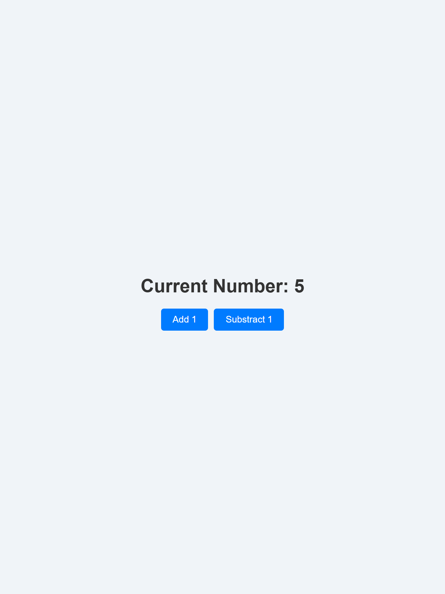

# Simple Counter App

## Introduction
This repository contains a simple counter application built using React. The app starts with a value of 0 and allows users to increase or decrease the value by 1 using dedicated buttons.

## Features
- Displays the current number.
- Includes "Add 1" and "Subtract 1" buttons to modify the counter.
- Uses React's `useState` hook for state management.
- Styled with CSS for a clean and interactive user interface.

## Getting Started
1. Clone the repository: `git clone <repository-url>`
2. Navigate to the project folder: `cd counter_app`
3. Install dependencies: `npm install`
4. Start the development server: `npm start`
5. Open your browser and visit `http://localhost:3000`

## Technologies Used
- React
- JavaScript
- CSS

## Screenshot

## Author
- [Justin Cupp/JCupp35]